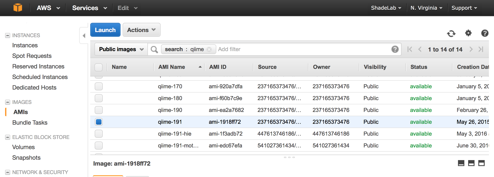

#How to set up a community AMI on Amazon EC2 for QIIME analysis.
Authored by Jackson Sorenson for EDAMAME2016, based on a previous tutorial by Kevin Hall and Tracy Teal for EDAMAME2014
[EDAMAME-2016 wiki](https://github.com/edamame-course/2016-tutorials/wiki)

***
EDAMAME tutorials have a CC-BY [license](https://github.com/edamame-course/2015-tutorials/blob/master/LICENSE.md). _Share, adapt, and attribute please!_
***

##Overarching Goal
* This tutorial will contribute towards an understanding of **cloud computing**

##Learning Objectives
* Select a community AMI image to initiate an Amazon EC2 instance
* Make and use a "key" for secure EC2 connection

***

Go to [Amazon Web Services](https://aws.amazon.com) in a web browser.

Select ‘My Account/Console’ menu option ‘AWS Management Console.”


Log in with your username & password. If you are new to _Amazon_ then select **'I am a new user.'** and create an account (NOTE: You do need a credit card, but there is a free tier of usage).

Click on **EC2** (towards the upper left of the page).


#### Step 0:

In the top right of the page between your login name and 'Help' there's a drop down menu with regions.
Select 'US East (N. Virginia)'.


Click on the blue “Launch Instance” button (midway down the page)

#### Step 1:

First we need to select an AMI. An AMI is essentially a picture of a particular computer set up. In the beginning of this course we will be using an AMI maintained by the QIIME developers. On the left side of your EC2 management console, search for "AMIs" under Images. Find the search bar in the center of your screen. Just to the left of that, make sure "Public Images is selected". In the search bar, search for "qiime" and you will see all of QIIMEs  community AMIs.



**Note**: QIIME updates do occur and they will occasionally create an updated community AMI. If you plan on using QIIME on a community AMI after this workshop, you should always check to make sure that you're working with the "Latest Amazon Web Services (AWS) virtual machine identifier". To check that, look [here](http://qiime.org/home_static/dataFiles.html)

Looks like we're using the most up-to-date!

#### Step 2:

Select the appropriate instance type. This depends on the size of the data you are working with.

For the purpose of this workshop we will choose **m3.large**

Select **Next: Configure Instance Details**

#### Step 3:

At this step you can change specific components of the instance.

For the purposes of this workshop we will not need to change any details.

Select **Next: Add Storage**

#### Step 4:

Set 100 Gb for this instance. If you have a particularly large data set, then you may want to request more data storage space.

For the purposes of this workshop, 100 Gb should be plenty of space for our data files.

Select **Next: Tag Instance**

#### Step 5:

As you become more adept at utilizing EC2 Instances, you may wish to create tags for them.

For the purposes of this workshop we will not need to create a tag of the instance.

Select **Next: Configure Security Group**

#### Step 6:

Here we **will** be making some changes.

1. Keep the default **Security Group Name**. Two independent users of the same AMI cannot have the same security group name, hence why we keep the default.

2. If you would like to give a description of the Security Group, then please feel free to do so at this time.

3. Next we will be adding some rules to the security group.

 * Keep the existing ssh rule.
 * Click on **Add Rule** and select HTTP.

 * Click on **Add Rule** and select HTTPS.

 * Click on **Add Rule** and select Custom TCP Rule. Change the Port Range to **8787**. Select **Anywhere** from the **Source** drop down menu.

 * Click on **Add Rule** and select Custom TCP Rule. Change the Port Range to **8888** . Select **Anywhere** from the **Source** drop down menu.

The Security Group Configuration should look like the image below once you add the above rules.


#### Click on the blue _Review and Launch_ button!

If you would like to, take the time to double check that everything is setup the way you intended.

Once you are sure that the EC2 Instance is set up the way you would like it to be set up, then click on the blue **Launch** button.

#### Key Pair Pop-up
You already have a key pair, so select **Choose an existing key pair**, pick your desired key, select the acknowledgement **(making sure you have access to .pem file)** and then click on the blue **Launch Instances** button.

If you need to download a new keyfile, feel free to do so.

* Click on the blue **Launch Instances** button.

At this point Amazon will give a warning saying that the EC2 instance you are starting is "open to the world". This means that anyone is capable of accessing the instance so long as they have the public DNS and the specific key file. We are not concerned about this warning, mostly because each of us will have our own keyfile that no one else will. This means even if I had your public DNS for your EC2 instance I couldn't login to it without you keyfile as well. If you want to have extra protection in the future, you can adjust the IP address ranges in the rules under the security group part of the EC2 setup to match your specific IP address. Keep in mind laptops will change IP addresses depending upon which network they are connected.  


#### EC2 Dashboard - Instances

At this point you will be brought to your list of Instances on the EC2 Dashboard. The instance you just launched will have a yellow pending circle next to it. When the yellow cirle changes to a green circle, your instance is up and running. In the example below, there are two instances currently running. Select your instance by clicking on the box to the left and you will see its details appear in the pane below your list of instances.


Locate the Public DNS for your instance. It should look something like this:

```
ec2-**some set of numbers**.compute-1.amazonaws.com.
```

At some point you will need to highlight and copy the Public DNS. This is the link to your specific instance that you started at Amazon Web Services (AWS).

#### Step 7: "Connecting to your EC2 Instance"

Do you remember how to connect to your instance? If not, see below.

###A. Find your EC2's Public DNS:
See Above

In the image above the full Public DNS of the highlighted instance is **ec2-52-5-171-50.compute-1.amazonaws.com**

###B. Open a Terminal:

You will need to know the location of your **key pair** you created when you launched your instance.  Usually this will be in your "Downloads" folder, but you may want to move it elsewhere.

```
cd /Directory/containing/your/keyfile
```

###C. Change your keyfile permisions to read only:

**Note: You only need to do this if you downloaded a new key file. If you're using an existing keyfile, then skip this step**

```
chmod 400 **/path/to/your/keyfile/**.pem
```
This command will adjust the permissions on your keyfile so that it cannot be edited. This is important because if the keyfile is edited or changed, it will no longer allow access to the EC2 instance.

###D. Connecting to your EC2 instance using ssh:

```
ssh -i **/path/to/your/keyfile/**eda.pem ubuntu@"your public DNS"
```

On your first login, you may get a prompt stating that the host authenticity cannot be established, are you sure you want to continue?  Yes, you really do.

SUCCESS! You have now logged into your computer in the cloud!

***
##Help and other resources
* [Set-up instructions from Amazon](http://docs.aws.amazon.com/AWSEC2/latest/UserGuide/get-set-up-for-amazon-ec2.html)
* [Amazon's help index for EC2](http://aws.amazon.com/ec2/getting-started/)
* [Technical documentation](http://docs.aws.amazon.com/AWSEC2/latest/UserGuide/concepts.html)


-----------------------------------------------
-----------------------------------------------
